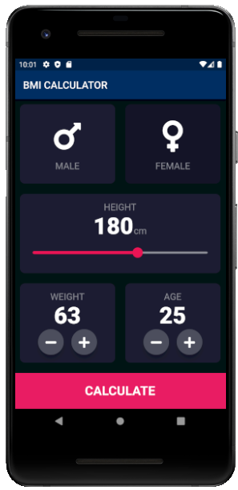

# bmi_calculator

The Body Mass Index (BMI) Calculator can be used to calculate BMI values based on height and weight. BMI is a fairly reliable indicator of body fatness for most people.

## 📸 ScreenShots

  
## Approach

BMI is a number calculated from an individual’s weight and height. To find out BMI we will take input from the user(both height and weight) using slider and buttons. Input will be stored in height and weight variables for further calculation. The calculation process is simple, we will simply divide weight in kilograms by the square of the height. Now as per the BMI calculated, it will execute the respective if-else statement and it will show us the result on the another screen and will also gives us suggestion base of our BMI value.

## Run the Project:
  
  - Install Flutter SDK
  - Clone the project
  - Run the following commands
  
    ```
    flutter pub get
    flutter run
    ```

## Getting Started

This project is a starting point for a Flutter application.

A few resources to get you started if this is your first Flutter project:

- [Lab: Write your first Flutter app](https://flutter.dev/docs/get-started/codelab)
- [Cookbook: Useful Flutter samples](https://flutter.dev/docs/cookbook)

For help getting started with Flutter, view our
[online documentation](https://flutter.dev/docs), which offers tutorials,
samples, guidance on mobile development, and a full API reference.
    
